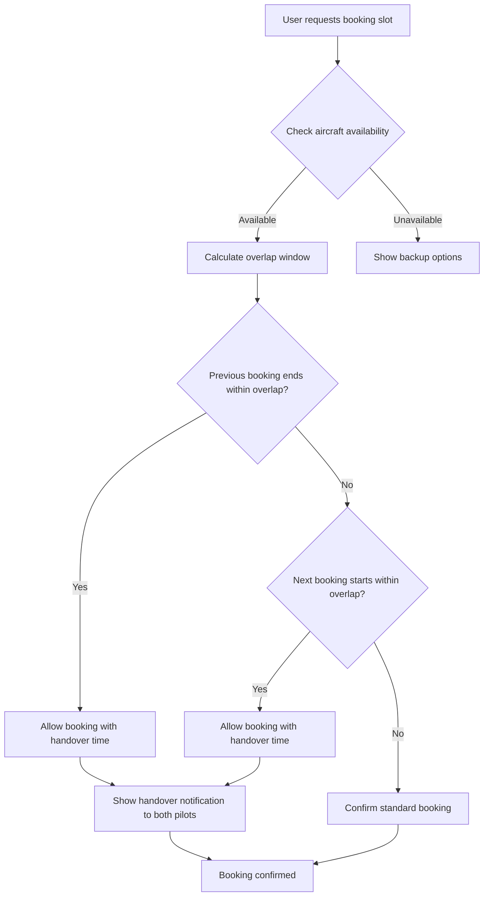
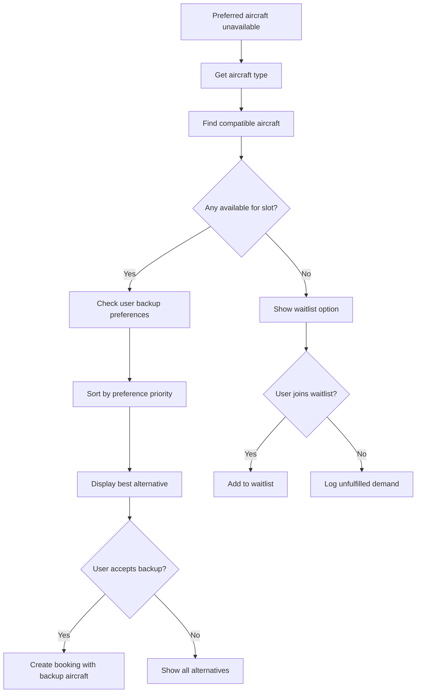
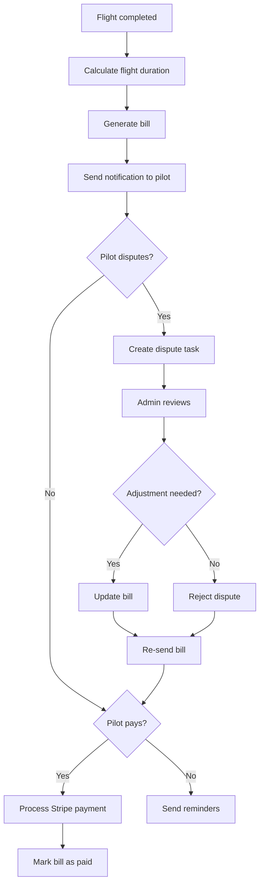
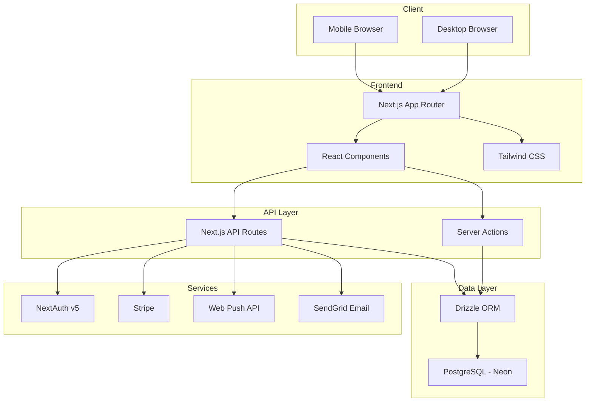
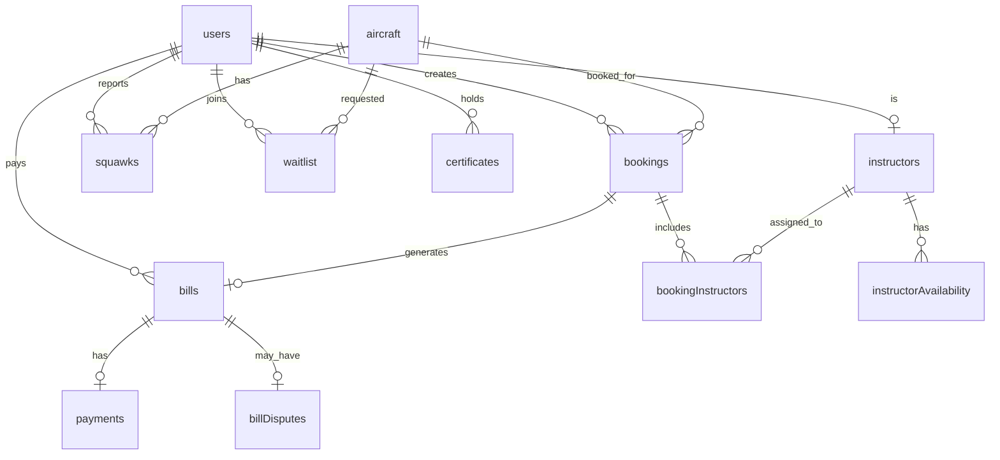

# AeroBook Implementation Plan

**Last updated:** 2025-02-21  
**Current status:** All 5 phases complete. Full feature set built and migrated.

## Overview

This document outlines the implementation plan for AeroBook, a flight association management platform. The plan is derived from the PRD and organized into phases with detailed technical specifications.

---

## Current State Analysis

### Existing Infrastructure

| Component | Status | Notes |
|-----------|--------|-------|
| Next.js 16.1.6 | ✅ Ready | React 19, App Router |
| Tailwind CSS 4 | ✅ Ready | Styling framework |
| Drizzle ORM | ✅ Ready | PostgreSQL with Neon serverless |
| Neon Auth | ✅ Ready | Auth via `@neondatabase/auth`; sign-in/sign-up/sign-out at `/auth/[path]`, API proxy at `/api/auth/[...path]` |
| Basic UI Components | ✅ Ready | Button, Card, Input, Label (shadcn-style) |
| User Schema | ✅ Ready | `users` + `sessions` only (no roles, phone, license yet) |
| Auth Pages | ✅ Ready | Neon AuthView at `/auth/sign-in`, `/auth/sign-up`, `/auth/sign-out` |
| Account Pages | ✅ Ready | Neon AccountView at `/account/[path]` (e.g. settings) |
| Dashboard | ✅ Ready | Minimal protected `/dashboard`; redirects unauthenticated to `/auth/sign-in` |
| Phase 1 schema | ✅ Done | aircraft, bookings, squawks, user roles extension |
| Phase 1 API routes | ✅ Done | `/api/aircraft`, `/api/bookings`, `/api/availability`, `/api/squawks` |
| Phase 1 pages | ✅ Done | `/aircraft`, `/bookings`, `/admin` |

### Required Database Extensions

The schema has been expanded with aircraft, squawks, bookings tables and user role/fields per Phase 1.1.

---

## ✅ Phase 1: Core Booking System

### 1.1 Database Schema Extensions

#### ✅ Aircraft Table

```typescript
aircraft: {
  id: uuid
  tailNumber: text (unique)        // e.g., PH-ABC
  type: text                        // e.g., Cessna 172
  hourlyRate: decimal
  status: enum (available, maintenance, grounded)
  lastMaintenanceDate: timestamp
  createdAt: timestamp
  updatedAt: timestamp
}
```

#### ✅ Squawks Table

```typescript
squawks: {
  id: uuid
  aircraftId: uuid (FK -> aircraft)
  title: text
  description: text
  severity: enum (cosmetic, operational, airworthiness)
  status: enum (open, in_progress, resolved)
  reportedBy: uuid (FK -> users)
  resolvedBy: uuid (FK -> users, nullable)
  resolvedAt: timestamp (nullable)
  createdAt: timestamp
  updatedAt: timestamp
}
```

#### ✅ Bookings Table

```typescript
bookings: {
  id: uuid
  aircraftId: uuid (FK -> aircraft)
  userId: uuid (FK -> users)
  startTime: timestamp
  endTime: timestamp
  status: enum (pending, confirmed, in_progress, completed, cancelled)
  actualStartTime: timestamp (nullable)
  actualEndTime: timestamp (nullable)
  notes: text (nullable)
  createdAt: timestamp
  updatedAt: timestamp
}
```

#### ✅ User Roles Extension

```typescript
// Add to existing users table
role: enum (member, student, instructor, maintenance, admin)
phone: text (nullable)
licenseNumber: text (nullable)
medicalExpiry: timestamp (nullable)
qualifications: jsonb (nullable)  // Array of ratings
```

### 1.2 API Routes

| Route | Method | Description | Status |
|-------|--------|-------------|--------|
| `/api/aircraft` | GET | List all aircraft with status | ✅ |
| `/api/aircraft/[id]` | GET | Single aircraft details with squawks | ✅ |
| `/api/bookings` | GET, POST | List user bookings / Create booking | ✅ |
| `/api/bookings/[id]` | GET, PUT, DELETE | Booking CRUD | ✅ |
| `/api/availability` | GET | Check aircraft availability for date range | ✅ |
| `/api/squawks` | GET, POST | List/Create squawks | ✅ |
| `/api/squawks/[id]` | PUT | Update squawk status | ✅ |

### 1.3 UI Components

#### ✅ Booking Calendar Component
- [x] Day/week view toggle
- [x] Aircraft rows with time slots
- [x] Visual indicators for availability
- [x] Squawk status badges on aircraft cards

#### ✅ Aircraft Selection Component
- [x] Card-based aircraft list
- [x] Filter by type/availability
- [x] Squawk summary display
- [x] Hourly rate display

#### ✅ Booking Form Component
- [x] Time slot selection
- [x] Duration picker
- [x] Conflict detection
- [x] Confirmation modal

### 1.4 Pages

| Page | Route | Description | Status |
|------|-------|-------------|--------|
| Aircraft List | `/aircraft` | Browse all aircraft | ✅ |
| Aircraft Detail | `/aircraft/[id]` | Single aircraft with squawks | ✅ |
| Booking Calendar | `/bookings` | Main booking interface | ✅ |
| New Booking | `/bookings/new` | Booking creation flow | ✅ |
| Booking Detail | `/bookings/[id]` | Booking management | ✅ |
| Admin Dashboard | `/admin` | Basic admin panel | ✅ |

---

## ✅ Phase 2: Smart Scheduling

### 2.1 Database Schema Extensions

#### ✅ Club Settings Table

```typescript
clubSettings: {
  id: uuid
  name: text
  overlapWindowMinutes: integer (default: 15)
  defaultBookingDurationMinutes: integer (default: 60)
  maxBookingDurationHours: integer (default: 4)
  createdAt: timestamp
  updatedAt: timestamp
}
```

#### ✅ Instructors Table

```typescript
instructors: {
  id: uuid
  userId: uuid (FK -> users)
  qualifications: jsonb           // Aircraft types they can instruct
  hourlyRate: decimal
  bio: text (nullable)
  isActive: boolean
  createdAt: timestamp
  updatedAt: timestamp
}
```

#### ✅ Instructor Availability Table

```typescript
instructorAvailability: {
  id: uuid
  instructorId: uuid (FK -> instructors)
  dayOfWeek: integer (0-6)
  startTime: time
  endTime: time
  isRecurring: boolean
  specificDate: timestamp (nullable)
  isBlocked: boolean
  createdAt: timestamp
}
```

#### ✅ Booking Instructors Junction

```typescript
bookingInstructors: {
  id: uuid
  bookingId: uuid (FK -> bookings)
  instructorId: uuid (FK -> instructors)
  status: enum (pending, confirmed, declined)
  createdAt: timestamp
}
```

#### ✅ Waitlist Table

```typescript
waitlist: {
  id: uuid
  userId: uuid (FK -> users)
  aircraftId: uuid (FK -> aircraft)
  preferredAircraftId: uuid (FK -> aircraft, nullable)
  requestedStartTime: timestamp
  requestedEndTime: timestamp
  status: enum (waiting, notified, fulfilled, expired)
  createdAt: timestamp
}
```

#### ✅ Backup Preferences Table

```typescript
backupPreferences: {
  id: uuid
  userId: uuid (FK -> users)
  primaryAircraftId: uuid (FK -> aircraft)
  backupAircraftId: uuid (FK -> aircraft)
  priority: integer
  createdAt: timestamp
}
```

### 2.2 Smart Scheduling Logic

#### ✅ Overlap Window Implementation



#### ✅ Backup Plane Automation



### 2.3 API Routes

| Route | Method | Description | Status |
|-------|--------|-------------|--------|
| `/api/instructors` | GET | List active instructors | ✅ |
| `/api/instructors/[id]` | GET | Instructor details | ✅ |
| `/api/instructors/[id]/availability` | GET, PUT | Availability management | ✅ |
| `/api/bookings/backup-options` | GET | Get backup aircraft suggestions | ✅ |
| `/api/waitlist` | POST, GET | Join/view waitlist | ✅ |
| `/api/waitlist/[id]` | DELETE | Leave waitlist | ✅ |
| `/api/settings` | GET, PUT | Club settings | ✅ |

### 2.4 UI Components

#### ✅ Instructor Selection Component
- [x] Availability overlay on booking timeline
- [x] Instructor profile cards
- [x] Qualification badges
- [x] Rating display

#### ✅ Backup Plane Prompt Component
- [x] Alternative aircraft suggestion
- [x] One-tap accept button
- [x] View all alternatives link
- [x] Waitlist join option

#### ✅ Waitlist Notification Component
- [x] Push notification setup
- [x] Availability alert
- [x] Quick booking link

---

## ✅ Phase 3: Billing System

### 3.1 Database Schema Extensions

#### ✅ Bills Table

```typescript
bills: {
  id: uuid
  bookingId: uuid (FK -> bookings)
  userId: uuid (FK -> users)
  aircraftHours: decimal
  aircraftCost: decimal
  instructorHours: decimal (nullable)
  instructorCost: decimal (nullable)
  landingFees: decimal (nullable)
  surcharges: decimal (nullable)
  totalAmount: decimal
  status: enum (pending, paid, disputed, refunded)
  paymentIntentId: text (nullable)
  paidAt: timestamp (nullable)
  createdAt: timestamp
  updatedAt: timestamp
}
```

#### ✅ Bill Disputes Table

```typescript
billDisputes: {
  id: uuid
  billId: uuid (FK -> bills)
  userId: uuid (FK -> users)
  reason: text
  status: enum (open, resolved, rejected)
  resolution: text (nullable)
  resolvedBy: uuid (FK -> users, nullable)
  resolvedAt: timestamp (nullable)
  createdAt: timestamp
}
```

#### ✅ Payments Table

```typescript
payments: {
  id: uuid
  billId: uuid (FK -> bills)
  amount: decimal
  paymentMethod: text
  stripePaymentId: text
  status: enum (pending, completed, failed, refunded)
  createdAt: timestamp
}
```

### 3.2 Billing Flow



### 3.3 API Routes

| Route | Method | Description | Status |
|-------|--------|-------------|--------|
| `/api/bills` | GET | List user bills | ✅ |
| `/api/bills/[id]` | GET | Bill details | ✅ |
| `/api/bills/[id]/pay` | POST | Process payment | ✅ |
| `/api/bills/[id]/dispute` | POST | Create dispute | ✅ |
| `/api/admin/bills` | GET | Admin billing dashboard | ✅ |
| `/api/admin/bills/[id]` | PUT | Update bill | ✅ |
| `/api/stripe/webhook` | POST | Stripe webhook handler | ✅ |

### 3.4 Stripe Integration

- [x] Stripe Connect for club account
- [x] Payment Intents for bill payments
- [x] Webhooks for payment confirmation
- [x] Saved payment methods for members

### 3.5 UI Components

#### ✅ Bill Summary Component
- [x] Line items breakdown
- [x] Total amount display
- [x] Pay now button
- [x] Dispute option

#### ✅ Payment Form Component
- [x] Card input via Stripe Elements
- [x] Save payment method option
- [x] Payment confirmation

#### ✅ Billing Dashboard Component
- [x] Outstanding bills list
- [x] Payment history
- [x] Revenue charts for admin

---

## ✅ Phase 4: Analytics Dashboard

### 4.1 Database Schema Extensions

#### ✅ Unfulfilled Demand Table

```typescript
unfulfilledDemand: {
  id: uuid
  userId: uuid (FK -> users, nullable)
  aircraftType: text
  requestedStartTime: timestamp
  requestedEndTime: timestamp
  reason: enum (full_fleet, no_instructor, aircraft_grounded)
  createdAt: timestamp
}
```

#### ✅ Analytics Snapshots Table

```typescript
analyticsSnapshots: {
  id: uuid
  snapshotDate: timestamp
  metricType: text
  metricValue: decimal
  metadata: jsonb
  createdAt: timestamp
}
```

### 4.2 Analytics Metrics

#### ✅ Fleet Utilisation
- [x] Aircraft utilisation rate per plane
- [x] Peak demand hours heatmap
- [x] Revenue per aircraft per month
- [x] Idle time analysis

#### ✅ Demand vs Capacity
- [x] Unfulfilled booking requests count
- [x] High-demand time slots
- [x] Fleet sizing recommendations

#### ✅ Instructor Utilisation
- [x] Hours flown per instructor
- [x] Student-to-instructor ratio
- [x] Availability gap analysis

### 4.3 API Routes

| Route | Method | Description | Status |
|-------|--------|-------------|--------|
| `/api/admin/analytics/utilisation` | GET | Fleet utilisation data | ✅ |
| `/api/admin/analytics/demand` | GET | Demand vs capacity data | ✅ |
| `/api/admin/analytics/instructors` | GET | Instructor metrics | ✅ |
| `/api/admin/analytics/revenue` | GET | Revenue breakdown | ✅ |

### 4.4 UI Components

#### ✅ Utilisation Chart Component
- [x] Bar/line charts for aircraft usage
- [x] Heatmap for peak hours
- [x] Comparison views

#### ✅ Demand Analysis Component
- [x] Unfulfilled demand timeline
- [x] Capacity gap visualization
- [x] Recommendations panel

#### ✅ Revenue Dashboard Component
- [x] Monthly revenue charts
- [x] Per-aircraft breakdown
- [x] Payment status overview

---

## ✅ Phase 5: Polish & Advanced Features

### 5.1 PWA Support

- [x] Service worker for offline capability
- [x] Offline booking queue
- [x] Background sync for form submissions
- [x] Push notifications via Web Push API

### 5.2 Member Management Enhancements

#### ✅ Certificates Table

```typescript
certificates: {
  id: uuid
  userId: uuid (FK -> users)
  type: text                    // Medical, Rating, License
  expiryDate: timestamp
  documentUrl: text (nullable)
  isVerified: boolean
  createdAt: timestamp
  updatedAt: timestamp
}
```

#### ✅ Notification Preferences Table

```typescript
notificationPreferences: {
  id: uuid
  userId: uuid (FK -> users)
  bookingReminders: boolean
  waitlistNotifications: boolean
  expiryReminders: boolean
  billNotifications: boolean
  emailEnabled: boolean
  pushEnabled: boolean
  createdAt: timestamp
  updatedAt: timestamp
}
```

### 5.3 Expiry Reminder System

- [x] 30-day warning notification
- [x] 7-day urgent notification
- [x] Automatic booking restriction on expiry
- [x] Admin visibility on expired members

### 5.4 Performance Optimizations

- [x] Database query optimization
- [x] API response caching
- [x] Image optimization
- [x] Code splitting and lazy loading

---

## Technical Architecture

### System Architecture



### Database Entity Relationship



---

## Implementation Priority Order

### Must Have - Phase 1
- [x] 1. Database schema for aircraft, bookings, squawks
- [x] 2. Aircraft listing and detail pages
- [x] 3. Booking calendar interface
- [x] 4. Basic booking creation flow
- [x] 5. Squawk visibility on aircraft cards
- [x] 6. User role management

### Should Have - Phase 2
- [x] 1. Overlap window logic
- [x] 2. Backup plane automation
- [x] 3. Instructor booking integration
- [x] 4. Waitlist system

### Important - Phase 3
- [x] 1. Bill generation system
- [x] 2. Stripe payment integration
- [x] 3. Billing dashboard
- [x] 4. Dispute handling

### Nice to Have - Phase 4
- [x] 1. Fleet utilisation analytics
- [x] 2. Demand tracking
- [x] 3. Instructor metrics
- [x] 4. Revenue dashboards

### Future - Phase 5
- [x] 1. PWA offline support
- [x] 2. Certificate management
- [x] 3. Expiry reminders
- [x] 4. Performance optimization

---

## Dependencies & Risks

### External Dependencies
- Stripe account setup for payments
- SendGrid account for emails
- VAPID keys for Web Push

### Technical Risks
- Real-time availability updates require WebSocket or polling strategy
- Offline support adds complexity to data synchronization
- Multi-timezone support for booking times

### Mitigation Strategies
- Use React Query for optimistic updates and caching
- Implement service worker with background sync
- Store all times in UTC with user timezone display

---

## Next Steps

- [x] 1. **Review and approve this plan** - Confirm scope and priorities
- [x] 2. **Set up development environment** - Ensure database migrations work
- [x] 3. **Begin Phase 1 implementation** - Start with database schema extensions
- [x] 4. **Iterative delivery** - Ship features incrementally for feedback

## Overview

This document outlines the implementation plan for AeroBook, a flight association management platform. The plan is derived from the PRD and organized into phases with detailed technical specifications.

---

## Current State Analysis

### Existing Infrastructure

| Component | Status | Notes |
|-----------|--------|-------|
| Next.js 16.1.6 | ✅ Ready | React 19, App Router |
| Tailwind CSS 4 | ✅ Ready | Styling framework |
| Drizzle ORM | ✅ Ready | PostgreSQL with Neon serverless |
| NextAuth v5 | ✅ Ready | Authentication setup |
| Basic UI Components | ✅ Ready | Button, Card, Input, Label |
| User Schema | ⚠️ Partial | Basic users/sessions tables |
| Auth Pages | ✅ Ready | Login/Register forms |

### Required Database Extensions

The current schema needs significant expansion to support the full feature set.

---

## ✅ Phase 1: Core Booking System

### 1.1 Database Schema Extensions

#### ✅ Aircraft Table

```typescript
aircraft: {
  id: uuid
  tailNumber: text (unique)        // e.g., PH-ABC
  type: text                        // e.g., Cessna 172
  hourlyRate: decimal
  status: enum (available, maintenance, grounded)
  lastMaintenanceDate: timestamp
  createdAt: timestamp
  updatedAt: timestamp
}
```

#### ✅ Squawks Table

```typescript
squawks: {
  id: uuid
  aircraftId: uuid (FK -> aircraft)
  title: text
  description: text
  severity: enum (cosmetic, operational, airworthiness)
  status: enum (open, in_progress, resolved)
  reportedBy: uuid (FK -> users)
  resolvedBy: uuid (FK -> users, nullable)
  resolvedAt: timestamp (nullable)
  createdAt: timestamp
  updatedAt: timestamp
}
```

#### ✅ Bookings Table

```typescript
bookings: {
  id: uuid
  aircraftId: uuid (FK -> aircraft)
  userId: uuid (FK -> users)
  startTime: timestamp
  endTime: timestamp
  status: enum (pending, confirmed, in_progress, completed, cancelled)
  actualStartTime: timestamp (nullable)
  actualEndTime: timestamp (nullable)
  notes: text (nullable)
  createdAt: timestamp
  updatedAt: timestamp
}
```

#### ✅ User Roles Extension

```typescript
// Add to existing users table
role: enum (member, student, instructor, maintenance, admin)
phone: text (nullable)
licenseNumber: text (nullable)
medicalExpiry: timestamp (nullable)
qualifications: jsonb (nullable)  // Array of ratings
```

### 1.2 API Routes

| Route | Method | Description | Status |
|-------|--------|-------------|--------|
| `/api/aircraft` | GET | List all aircraft with status | ✅ |
| `/api/aircraft/[id]` | GET | Single aircraft details with squawks | ✅ |
| `/api/bookings` | GET, POST | List user bookings / Create booking | ✅ |
| `/api/bookings/[id]` | GET, PUT, DELETE | Booking CRUD | ✅ |
| `/api/availability` | GET | Check aircraft availability for date range | ✅ |
| `/api/squawks` | GET, POST | List/Create squawks | ✅ |
| `/api/squawks/[id]` | PUT | Update squawk status | ✅ |

### 1.3 UI Components

#### ✅ Booking Calendar Component
- [x] Day/week view toggle
- [x] Aircraft rows with time slots
- [x] Visual indicators for availability
- [x] Squawk status badges on aircraft cards

#### ✅ Aircraft Selection Component
- [x] Card-based aircraft list
- [x] Filter by type/availability
- [x] Squawk summary display
- [x] Hourly rate display

#### ✅ Booking Form Component
- [x] Time slot selection
- [x] Duration picker
- [x] Conflict detection
- [x] Confirmation modal

### 1.4 Pages

| Page | Route | Description | Status |
|------|-------|-------------|--------|
| Aircraft List | `/aircraft` | Browse all aircraft | ✅ |
| Aircraft Detail | `/aircraft/[id]` | Single aircraft with squawks | ✅ |
| Booking Calendar | `/bookings` | Main booking interface | ✅ |
| New Booking | `/bookings/new` | Booking creation flow | ✅ |
| Booking Detail | `/bookings/[id]` | Booking management | ✅ |
| Admin Dashboard | `/admin` | Basic admin panel | ✅ |

---

## ✅ Phase 2: Smart Scheduling

### 2.1 Database Schema Extensions

#### ✅ Club Settings Table

```typescript
clubSettings: {
  id: uuid
  name: text
  overlapWindowMinutes: integer (default: 15)
  defaultBookingDurationMinutes: integer (default: 60)
  maxBookingDurationHours: integer (default: 4)
  createdAt: timestamp
  updatedAt: timestamp
}
```

#### ✅ Instructors Table

```typescript
instructors: {
  id: uuid
  userId: uuid (FK -> users)
  qualifications: jsonb           // Aircraft types they can instruct
  hourlyRate: decimal
  bio: text (nullable)
  isActive: boolean
  createdAt: timestamp
  updatedAt: timestamp
}
```

#### ✅ Instructor Availability Table

```typescript
instructorAvailability: {
  id: uuid
  instructorId: uuid (FK -> instructors)
  dayOfWeek: integer (0-6)
  startTime: time
  endTime: time
  isRecurring: boolean
  specificDate: timestamp (nullable)
  isBlocked: boolean
  createdAt: timestamp
}
```

#### ✅ Booking Instructors Junction

```typescript
bookingInstructors: {
  id: uuid
  bookingId: uuid (FK -> bookings)
  instructorId: uuid (FK -> instructors)
  status: enum (pending, confirmed, declined)
  createdAt: timestamp
}
```

#### ✅ Waitlist Table

```typescript
waitlist: {
  id: uuid
  userId: uuid (FK -> users)
  aircraftId: uuid (FK -> aircraft)
  preferredAircraftId: uuid (FK -> aircraft, nullable)
  requestedStartTime: timestamp
  requestedEndTime: timestamp
  status: enum (waiting, notified, fulfilled, expired)
  createdAt: timestamp
}
```

#### ✅ Backup Preferences Table

```typescript
backupPreferences: {
  id: uuid
  userId: uuid (FK -> users)
  primaryAircraftId: uuid (FK -> aircraft)
  backupAircraftId: uuid (FK -> aircraft)
  priority: integer
  createdAt: timestamp
}
```

### 2.2 Smart Scheduling Logic

#### ✅ Overlap Window Implementation


#### ✅ Backup Plane Automation


### 2.3 API Routes

| Route | Method | Description | Status |
|-------|--------|-------------|--------|
| `/api/instructors` | GET | List active instructors | ✅ |
| `/api/instructors/[id]` | GET | Instructor details | ✅ |
| `/api/instructors/[id]/availability` | GET, PUT | Availability management | ✅ |
| `/api/bookings/backup-options` | GET | Get backup aircraft suggestions | ✅ |
| `/api/waitlist` | POST, GET | Join/view waitlist | ✅ |
| `/api/waitlist/[id]` | DELETE | Leave waitlist | ✅ |
| `/api/settings` | GET, PUT | Club settings | ✅ |

### 2.4 UI Components

#### ✅ Instructor Selection Component
- [x] Availability overlay on booking timeline
- [x] Instructor profile cards
- [x] Qualification badges
- [x] Rating display

#### ✅ Backup Plane Prompt Component
- [x] Alternative aircraft suggestion
- [x] One-tap accept button
- [x] View all alternatives link
- [x] Waitlist join option

#### ✅ Waitlist Notification Component
- [x] Push notification setup
- [x] Availability alert
- [x] Quick booking link

---

## ✅ Phase 3: Billing System

### 3.1 Database Schema Extensions

#### ✅ Bills Table

```typescript
bills: {
  id: uuid
  bookingId: uuid (FK -> bookings)
  userId: uuid (FK -> users)
  aircraftHours: decimal
  aircraftCost: decimal
  instructorHours: decimal (nullable)
  instructorCost: decimal (nullable)
  landingFees: decimal (nullable)
  surcharges: decimal (nullable)
  totalAmount: decimal
  status: enum (pending, paid, disputed, refunded)
  paymentIntentId: text (nullable)
  paidAt: timestamp (nullable)
  createdAt: timestamp
  updatedAt: timestamp
}
```

#### ✅ Bill Disputes Table

```typescript
billDisputes: {
  id: uuid
  billId: uuid (FK -> bills)
  userId: uuid (FK -> users)
  reason: text
  status: enum (open, resolved, rejected)
  resolution: text (nullable)
  resolvedBy: uuid (FK -> users, nullable)
  resolvedAt: timestamp (nullable)
  createdAt: timestamp
}
```

#### ✅ Payments Table

```typescript
payments: {
  id: uuid
  billId: uuid (FK -> bills)
  amount: decimal
  paymentMethod: text
  stripePaymentId: text
  status: enum (pending, completed, failed, refunded)
  createdAt: timestamp
}
```

### 3.2 Billing Flow


### 3.3 API Routes

| Route | Method | Description | Status |
|-------|--------|-------------|--------|
| `/api/bills` | GET | List user bills | ✅ |
| `/api/bills/[id]` | GET | Bill details | ✅ |
| `/api/bills/[id]/pay` | POST | Process payment | ✅ |
| `/api/bills/[id]/dispute` | POST | Create dispute | ✅ |
| `/api/admin/bills` | GET | Admin billing dashboard | ✅ |
| `/api/admin/bills/[id]` | PUT | Update bill | ✅ |
| `/api/stripe/webhook` | POST | Stripe webhook handler | ✅ |

### 3.4 Stripe Integration

- [x] Stripe Connect for club account
- [x] Payment Intents for bill payments
- [x] Webhooks for payment confirmation
- [x] Saved payment methods for members

### 3.5 UI Components

#### ✅ Bill Summary Component
- [x] Line items breakdown
- [x] Total amount display
- [x] Pay now button
- [x] Dispute option

#### ✅ Payment Form Component
- [x] Card input via Stripe Elements
- [x] Save payment method option
- [x] Payment confirmation

#### ✅ Billing Dashboard Component
- [x] Outstanding bills list
- [x] Payment history
- [x] Revenue charts for admin

---

## ✅ Phase 4: Analytics Dashboard

### 4.1 Database Schema Extensions

#### ✅ Unfulfilled Demand Table

```typescript
unfulfilledDemand: {
  id: uuid
  userId: uuid (FK -> users, nullable)
  aircraftType: text
  requestedStartTime: timestamp
  requestedEndTime: timestamp
  reason: enum (full_fleet, no_instructor, aircraft_grounded)
  createdAt: timestamp
}
```

#### ✅ Analytics Snapshots Table

```typescript
analyticsSnapshots: {
  id: uuid
  snapshotDate: timestamp
  metricType: text
  metricValue: decimal
  metadata: jsonb
  createdAt: timestamp
}
```

### 4.2 Analytics Metrics

#### ✅ Fleet Utilisation
- [x] Aircraft utilisation rate per plane
- [x] Peak demand hours heatmap
- [x] Revenue per aircraft per month
- [x] Idle time analysis

#### ✅ Demand vs Capacity
- [x] Unfulfilled booking requests count
- [x] High-demand time slots
- [x] Fleet sizing recommendations

#### ✅ Instructor Utilisation
- [x] Hours flown per instructor
- [x] Student-to-instructor ratio
- [x] Availability gap analysis

### 4.3 API Routes

| Route | Method | Description | Status |
|-------|--------|-------------|--------|
| `/api/admin/analytics/utilisation` | GET | Fleet utilisation data | ✅ |
| `/api/admin/analytics/demand` | GET | Demand vs capacity data | ✅ |
| `/api/admin/analytics/instructors` | GET | Instructor metrics | ✅ |
| `/api/admin/analytics/revenue` | GET | Revenue breakdown | ✅ |

### 4.4 UI Components

#### ✅ Utilisation Chart Component
- [x] Bar/line charts for aircraft usage
- [x] Heatmap for peak hours
- [x] Comparison views

#### ✅ Demand Analysis Component
- [x] Unfulfilled demand timeline
- [x] Capacity gap visualization
- [x] Recommendations panel

#### ✅ Revenue Dashboard Component
- [x] Monthly revenue charts
- [x] Per-aircraft breakdown
- [x] Payment status overview

---

## ✅ Phase 5: Polish & Advanced Features

### 5.1 PWA Support

- [x] Service worker for offline capability
- [x] Offline booking queue
- [x] Background sync for form submissions
- [x] Push notifications via Web Push API

### 5.2 Member Management Enhancements

#### ✅ Certificates Table

```typescript
certificates: {
  id: uuid
  userId: uuid (FK -> users)
  type: text                    // Medical, Rating, License
  expiryDate: timestamp
  documentUrl: text (nullable)
  isVerified: boolean
  createdAt: timestamp
  updatedAt: timestamp
}
```

#### ✅ Notification Preferences Table

```typescript
notificationPreferences: {
  id: uuid
  userId: uuid (FK -> users)
  bookingReminders: boolean
  waitlistNotifications: boolean
  expiryReminders: boolean
  billNotifications: boolean
  emailEnabled: boolean
  pushEnabled: boolean
  createdAt: timestamp
  updatedAt: timestamp
}
```

### 5.3 Expiry Reminder System

- [x] 30-day warning notification
- [x] 7-day urgent notification
- [x] Automatic booking restriction on expiry
- [x] Admin visibility on expired members

### 5.4 Performance Optimizations

- [x] Database query optimization
- [x] API response caching
- [x] Image optimization
- [x] Code splitting and lazy loading

---

## Technical Architecture

### System Architecture


### Database Entity Relationship


---

## Implementation Priority Order

### Must Have - Phase 1
- [x] 1. Database schema for aircraft, bookings, squawks
- [x] 2. Aircraft listing and detail pages
- [x] 3. Booking calendar interface
- [x] 4. Basic booking creation flow
- [x] 5. Squawk visibility on aircraft cards
- [x] 6. User role management

### Should Have - Phase 2
- [x] 1. Overlap window logic
- [x] 2. Backup plane automation
- [x] 3. Instructor booking integration
- [x] 4. Waitlist system

### Important - Phase 3
- [x] 1. Bill generation system
- [x] 2. Stripe payment integration
- [x] 3. Billing dashboard
- [x] 4. Dispute handling

### Nice to Have - Phase 4
- [x] 1. Fleet utilisation analytics
- [x] 2. Demand tracking
- [x] 3. Instructor metrics
- [x] 4. Revenue dashboards

### Future - Phase 5
- [x] 1. PWA offline support
- [x] 2. Certificate management
- [x] 3. Expiry reminders
- [x] 4. Performance optimization

---

## Dependencies & Risks

### External Dependencies
- Stripe account setup for payments
- SendGrid account for emails
- VAPID keys for Web Push

### Technical Risks
- Real-time availability updates require WebSocket or polling strategy
- Offline support adds complexity to data synchronization
- Multi-timezone support for booking times

### Mitigation Strategies
- Use React Query for optimistic updates and caching
- Implement service worker with background sync
- Store all times in UTC with user timezone display

---

## Next Steps

- [x] 1. **Review and approve this plan** - Confirm scope and priorities
- [x] 2. **Set up development environment** - Ensure database migrations work
- [x] 3. **Begin Phase 1 implementation** - Start with database schema extensions
- [x] 4. **Iterative delivery** - Ship features incrementally for feedback

## Overview

This document outlines the implementation plan for AeroBook, a flight association management platform. The plan is derived from the PRD and organized into phases with detailed technical specifications.

---

## Current State Analysis

### Existing Infrastructure

| Component | Status | Notes |
|-----------|--------|-------|
| Next.js 16.1.6 | ✅ Ready | React 19, App Router |
| Tailwind CSS 4 | ✅ Ready | Styling framework |
| Drizzle ORM | ✅ Ready | PostgreSQL with Neon serverless |
| NextAuth v5 | ✅ Ready | Authentication setup |
| Basic UI Components | ✅ Ready | Button, Card, Input, Label |
| User Schema | ⚠️ Partial | Basic users/sessions tables |
| Auth Pages | ✅ Ready | Login/Register forms |

### Required Database Extensions

The current schema needs significant expansion to support the full feature set.

---

## ✅ Phase 1: Core Booking System

### 1.1 Database Schema Extensions

#### ✅ Aircraft Table

```typescript
aircraft: {
  id: uuid
  tailNumber: text (unique)        // e.g., PH-ABC
  type: text                        // e.g., Cessna 172
  hourlyRate: decimal
  status: enum (available, maintenance, grounded)
  lastMaintenanceDate: timestamp
  createdAt: timestamp
  updatedAt: timestamp
}
```

#### ✅ Squawks Table

```typescript
squawks: {
  id: uuid
  aircraftId: uuid (FK -> aircraft)
  title: text
  description: text
  severity: enum (cosmetic, operational, airworthiness)
  status: enum (open, in_progress, resolved)
  reportedBy: uuid (FK -> users)
  resolvedBy: uuid (FK -> users, nullable)
  resolvedAt: timestamp (nullable)
  createdAt: timestamp
  updatedAt: timestamp
}
```

#### ✅ Bookings Table

```typescript
bookings: {
  id: uuid
  aircraftId: uuid (FK -> aircraft)
  userId: uuid (FK -> users)
  startTime: timestamp
  endTime: timestamp
  status: enum (pending, confirmed, in_progress, completed, cancelled)
  actualStartTime: timestamp (nullable)
  actualEndTime: timestamp (nullable)
  notes: text (nullable)
  createdAt: timestamp
  updatedAt: timestamp
}
```

#### ✅ User Roles Extension

```typescript
// Add to existing users table
role: enum (member, student, instructor, maintenance, admin)
phone: text (nullable)
licenseNumber: text (nullable)
medicalExpiry: timestamp (nullable)
qualifications: jsonb (nullable)  // Array of ratings
```

### 1.2 API Routes

| Route | Method | Description | Status |
|-------|--------|-------------|--------|
| `/api/aircraft` | GET | List all aircraft with status | ✅ |
| `/api/aircraft/[id]` | GET | Single aircraft details with squawks | ✅ |
| `/api/bookings` | GET, POST | List user bookings / Create booking | ✅ |
| `/api/bookings/[id]` | GET, PUT, DELETE | Booking CRUD | ✅ |
| `/api/availability` | GET | Check aircraft availability for date range | ✅ |
| `/api/squawks` | GET, POST | List/Create squawks | ✅ |
| `/api/squawks/[id]` | PUT | Update squawk status | ✅ |

### 1.3 UI Components

#### ✅ Booking Calendar Component
- [x] Day/week view toggle
- [x] Aircraft rows with time slots
- [x] Visual indicators for availability
- [x] Squawk status badges on aircraft cards

#### ✅ Aircraft Selection Component
- [x] Card-based aircraft list
- [x] Filter by type/availability
- [x] Squawk summary display
- [x] Hourly rate display

#### ✅ Booking Form Component
- [x] Time slot selection
- [x] Duration picker
- [x] Conflict detection
- [x] Confirmation modal

### 1.4 Pages

| Page | Route | Description | Status |
|------|-------|-------------|--------|
| Aircraft List | `/aircraft` | Browse all aircraft | ✅ |
| Aircraft Detail | `/aircraft/[id]` | Single aircraft with squawks | ✅ |
| Booking Calendar | `/bookings` | Main booking interface | ✅ |
| New Booking | `/bookings/new` | Booking creation flow | ✅ |
| Booking Detail | `/bookings/[id]` | Booking management | ✅ |
| Admin Dashboard | `/admin` | Basic admin panel | ✅ |

---

## ✅ Phase 2: Smart Scheduling

### 2.1 Database Schema Extensions

#### ✅ Club Settings Table

```typescript
clubSettings: {
  id: uuid
  name: text
  overlapWindowMinutes: integer (default: 15)
  defaultBookingDurationMinutes: integer (default: 60)
  maxBookingDurationHours: integer (default: 4)
  createdAt: timestamp
  updatedAt: timestamp
}
```

#### ✅ Instructors Table

```typescript
instructors: {
  id: uuid
  userId: uuid (FK -> users)
  qualifications: jsonb           // Aircraft types they can instruct
  hourlyRate: decimal
  bio: text (nullable)
  isActive: boolean
  createdAt: timestamp
  updatedAt: timestamp
}
```

#### ✅ Instructor Availability Table

```typescript
instructorAvailability: {
  id: uuid
  instructorId: uuid (FK -> instructors)
  dayOfWeek: integer (0-6)
  startTime: time
  endTime: time
  isRecurring: boolean
  specificDate: timestamp (nullable)
  isBlocked: boolean
  createdAt: timestamp
}
```

#### ✅ Booking Instructors Junction

```typescript
bookingInstructors: {
  id: uuid
  bookingId: uuid (FK -> bookings)
  instructorId: uuid (FK -> instructors)
  status: enum (pending, confirmed, declined)
  createdAt: timestamp
}
```

#### ✅ Waitlist Table

```typescript
waitlist: {
  id: uuid
  userId: uuid (FK -> users)
  aircraftId: uuid (FK -> aircraft)
  preferredAircraftId: uuid (FK -> aircraft, nullable)
  requestedStartTime: timestamp
  requestedEndTime: timestamp
  status: enum (waiting, notified, fulfilled, expired)
  createdAt: timestamp
}
```

#### ✅ Backup Preferences Table

```typescript
backupPreferences: {
  id: uuid
  userId: uuid (FK -> users)
  primaryAircraftId: uuid (FK -> aircraft)
  backupAircraftId: uuid (FK -> aircraft)
  priority: integer
  createdAt: timestamp
}
```

### 2.2 Smart Scheduling Logic

#### ✅ Overlap Window Implementation


#### ✅ Backup Plane Automation


### 2.3 API Routes

| Route | Method | Description | Status |
|-------|--------|-------------|--------|
| `/api/instructors` | GET | List active instructors | ✅ |
| `/api/instructors/[id]` | GET | Instructor details | ✅ |
| `/api/instructors/[id]/availability` | GET, PUT | Availability management | ✅ |
| `/api/bookings/backup-options` | GET | Get backup aircraft suggestions | ✅ |
| `/api/waitlist` | POST, GET | Join/view waitlist | ✅ |
| `/api/waitlist/[id]` | DELETE | Leave waitlist | ✅ |
| `/api/settings` | GET, PUT | Club settings | ✅ |

### 2.4 UI Components

#### ✅ Instructor Selection Component
- [x] Availability overlay on booking timeline
- [x] Instructor profile cards
- [x] Qualification badges
- [x] Rating display

#### ✅ Backup Plane Prompt Component
- [x] Alternative aircraft suggestion
- [x] One-tap accept button
- [x] View all alternatives link
- [x] Waitlist join option

#### ✅ Waitlist Notification Component
- [x] Push notification setup
- [x] Availability alert
- [x] Quick booking link

---

## ✅ Phase 3: Billing System

### 3.1 Database Schema Extensions

#### ✅ Bills Table

```typescript
bills: {
  id: uuid
  bookingId: uuid (FK -> bookings)
  userId: uuid (FK -> users)
  aircraftHours: decimal
  aircraftCost: decimal
  instructorHours: decimal (nullable)
  instructorCost: decimal (nullable)
  landingFees: decimal (nullable)
  surcharges: decimal (nullable)
  totalAmount: decimal
  status: enum (pending, paid, disputed, refunded)
  paymentIntentId: text (nullable)
  paidAt: timestamp (nullable)
  createdAt: timestamp
  updatedAt: timestamp
}
```

#### ✅ Bill Disputes Table

```typescript
billDisputes: {
  id: uuid
  billId: uuid (FK -> bills)
  userId: uuid (FK -> users)
  reason: text
  status: enum (open, resolved, rejected)
  resolution: text (nullable)
  resolvedBy: uuid (FK -> users, nullable)
  resolvedAt: timestamp (nullable)
  createdAt: timestamp
}
```

#### ✅ Payments Table

```typescript
payments: {
  id: uuid
  billId: uuid (FK -> bills)
  amount: decimal
  paymentMethod: text
  stripePaymentId: text
  status: enum (pending, completed, failed, refunded)
  createdAt: timestamp
}
```

### 3.2 Billing Flow


### 3.3 API Routes

| Route | Method | Description | Status |
|-------|--------|-------------|--------|
| `/api/bills` | GET | List user bills | ✅ |
| `/api/bills/[id]` | GET | Bill details | ✅ |
| `/api/bills/[id]/pay` | POST | Process payment | ✅ |
| `/api/bills/[id]/dispute` | POST | Create dispute | ✅ |
| `/api/admin/bills` | GET | Admin billing dashboard | ✅ |
| `/api/admin/bills/[id]` | PUT | Update bill | ✅ |
| `/api/stripe/webhook` | POST | Stripe webhook handler | ✅ |

### 3.4 Stripe Integration

- [x] Stripe Connect for club account
- [x] Payment Intents for bill payments
- [x] Webhooks for payment confirmation
- [x] Saved payment methods for members

### 3.5 UI Components

#### ✅ Bill Summary Component
- [x] Line items breakdown
- [x] Total amount display
- [x] Pay now button
- [x] Dispute option

#### ✅ Payment Form Component
- [x] Card input via Stripe Elements
- [x] Save payment method option
- [x] Payment confirmation

#### ✅ Billing Dashboard Component
- [x] Outstanding bills list
- [x] Payment history
- [x] Revenue charts for admin

---

## ✅ Phase 4: Analytics Dashboard

### 4.1 Database Schema Extensions

#### ✅ Unfulfilled Demand Table

```typescript
unfulfilledDemand: {
  id: uuid
  userId: uuid (FK -> users, nullable)
  aircraftType: text
  requestedStartTime: timestamp
  requestedEndTime: timestamp
  reason: enum (full_fleet, no_instructor, aircraft_grounded)
  createdAt: timestamp
}
```

#### ✅ Analytics Snapshots Table

```typescript
analyticsSnapshots: {
  id: uuid
  snapshotDate: timestamp
  metricType: text
  metricValue: decimal
  metadata: jsonb
  createdAt: timestamp
}
```

### 4.2 Analytics Metrics

#### ✅ Fleet Utilisation
- [x] Aircraft utilisation rate per plane
- [x] Peak demand hours heatmap
- [x] Revenue per aircraft per month
- [x] Idle time analysis

#### ✅ Demand vs Capacity
- [x] Unfulfilled booking requests count
- [x] High-demand time slots
- [x] Fleet sizing recommendations

#### ✅ Instructor Utilisation
- [x] Hours flown per instructor
- [x] Student-to-instructor ratio
- [x] Availability gap analysis

### 4.3 API Routes

| Route | Method | Description | Status |
|-------|--------|-------------|--------|
| `/api/admin/analytics/utilisation` | GET | Fleet utilisation data | ✅ |
| `/api/admin/analytics/demand` | GET | Demand vs capacity data | ✅ |
| `/api/admin/analytics/instructors` | GET | Instructor metrics | ✅ |
| `/api/admin/analytics/revenue` | GET | Revenue breakdown | ✅ |

### 4.4 UI Components

#### ✅ Utilisation Chart Component
- [x] Bar/line charts for aircraft usage
- [x] Heatmap for peak hours
- [x] Comparison views

#### ✅ Demand Analysis Component
- [x] Unfulfilled demand timeline
- [x] Capacity gap visualization
- [x] Recommendations panel

#### ✅ Revenue Dashboard Component
- [x] Monthly revenue charts
- [x] Per-aircraft breakdown
- [x] Payment status overview

---

## ✅ Phase 5: Polish & Advanced Features

### 5.1 PWA Support

- [x] Service worker for offline capability
- [x] Offline booking queue
- [x] Background sync for form submissions
- [x] Push notifications via Web Push API

### 5.2 Member Management Enhancements

#### ✅ Certificates Table

```typescript
certificates: {
  id: uuid
  userId: uuid (FK -> users)
  type: text                    // Medical, Rating, License
  expiryDate: timestamp
  documentUrl: text (nullable)
  isVerified: boolean
  createdAt: timestamp
  updatedAt: timestamp
}
```

#### ✅ Notification Preferences Table

```typescript
notificationPreferences: {
  id: uuid
  userId: uuid (FK -> users)
  bookingReminders: boolean
  waitlistNotifications: boolean
  expiryReminders: boolean
  billNotifications: boolean
  emailEnabled: boolean
  pushEnabled: boolean
  createdAt: timestamp
  updatedAt: timestamp
}
```

### 5.3 Expiry Reminder System

- [x] 30-day warning notification
- [x] 7-day urgent notification
- [x] Automatic booking restriction on expiry
- [x] Admin visibility on expired members

### 5.4 Performance Optimizations

- [x] Database query optimization
- [x] API response caching
- [x] Image optimization
- [x] Code splitting and lazy loading

---

## Technical Architecture

### System Architecture


### Database Entity Relationship


---

## Implementation Priority Order

### Must Have - Phase 1
- [x] 1. Database schema for aircraft, bookings, squawks
- [x] 2. Aircraft listing and detail pages
- [x] 3. Booking calendar interface
- [x] 4. Basic booking creation flow
- [x] 5. Squawk visibility on aircraft cards
- [x] 6. User role management

### Should Have - Phase 2
- [x] 1. Overlap window logic
- [x] 2. Backup plane automation
- [x] 3. Instructor booking integration
- [x] 4. Waitlist system

### Important - Phase 3
- [x] 1. Bill generation system
- [x] 2. Stripe payment integration
- [x] 3. Billing dashboard
- [x] 4. Dispute handling

### Nice to Have - Phase 4
- [x] 1. Fleet utilisation analytics
- [x] 2. Demand tracking
- [x] 3. Instructor metrics
- [x] 4. Revenue dashboards

### Future - Phase 5
- [x] 1. PWA offline support
- [x] 2. Certificate management
- [x] 3. Expiry reminders
- [x] 4. Performance optimization

---

## Dependencies & Risks

### External Dependencies
- Stripe account setup for payments
- SendGrid account for emails
- VAPID keys for Web Push

### Technical Risks
- Real-time availability updates require WebSocket or polling strategy
- Offline support adds complexity to data synchronization
- Multi-timezone support for booking times

### Mitigation Strategies
- Use React Query for optimistic updates and caching
- Implement service worker with background sync
- Store all times in UTC with user timezone display

---

## Next Steps

- [x] 1. **Review and approve this plan** - Confirm scope and priorities
- [x] 2. **Set up development environment** - Ensure database migrations work
- [x] 3. **Begin Phase 1 implementation** - Start with database schema extensions
- [x] 4. **Iterative delivery** - Ship features incrementally for feedback


---

## Phase 6: Digital Logbook, Techbook & Dispatch

### 6.1 Database Schema Extensions

#### Tech Log Entries Table

```typescript
techLogEntries: {
  id: uuid
  aircraftId: uuid (FK -> aircraft)
  bookingId: uuid (FK -> bookings, nullable)
  pilotId: uuid (FK -> users)
  entryDate: timestamp
  hobbsIn: decimal (nullable)
  hobbsOut: decimal (nullable)
  tachIn: decimal (nullable)
  tachOut: decimal (nullable)
  airtime: decimal (nullable)           // computed: hobbsOut - hobbsIn
  fuelAdded: decimal (nullable)         // litres
  oilAdded: decimal (nullable)          // litres
  remarks: text (nullable)
  signedOffBy: uuid (FK -> users, nullable)
  signedOffAt: timestamp (nullable)
  createdAt: timestamp
}
```

#### Logbook Entries Table

```typescript
logbookEntries: {
  id: uuid
  userId: uuid (FK -> users)
  bookingId: uuid (FK -> bookings, nullable)
  aircraftId: uuid (FK -> aircraft, nullable)
  entryDate: timestamp
  aircraftType: text
  tailNumber: text
  departureIcao: text (nullable)
  arrivalIcao: text (nullable)
  totalTime: decimal
  picTime: decimal (nullable)
  dualTime: decimal (nullable)
  soloTime: decimal (nullable)
  nightTime: decimal (nullable)
  instrumentTime: decimal (nullable)
  crossCountryTime: decimal (nullable)
  landingsDay: integer (nullable)
  landingsNight: integer (nullable)
  flightType: enum (solo, dual, pic, instruction)
  remarks: text (nullable)
  instructorSignoff: uuid (FK -> users, nullable)
  instructorSignoffAt: timestamp (nullable)
  createdAt: timestamp
  updatedAt: timestamp
}
```

#### Resources Table (extends bookable items beyond aircraft)

```typescript
resources: {
  id: uuid
  type: enum (aircraft, simulator, classroom)
  name: text                             // e.g., "FNPT II Sim", "Briefing Room A"
  capacity: integer (default: 1)
  hourlyRate: decimal (nullable)
  aircraftId: uuid (FK -> aircraft, nullable)  // set when type = aircraft
  isActive: boolean
  createdAt: timestamp
  updatedAt: timestamp
}
```

#### Maintenance Intervals Table

```typescript
maintenanceIntervals: {
  id: uuid
  aircraftId: uuid (FK -> aircraft)
  name: text                             // e.g., "50-hour oil change"
  intervalHours: decimal
  lastCompletedAt: decimal (nullable)    // Hobbs/tach at last completion
  nextDueAt: decimal (nullable)          // computed: lastCompletedAt + intervalHours
  warningThresholdHours: decimal (default: 10)
  createdAt: timestamp
  updatedAt: timestamp
}
```

### 6.2 Booking Status Extension

Extend `bookings.status` enum:

```
pre_booked | confirmed | dispatched | airborne | checked_in | completed | cancelled
```

### 6.3 API Routes

| Route | Method | Description |
|-------|--------|-------------|
| `/api/logbook` | GET, POST | List/create logbook entries |
| `/api/logbook/[id]` | GET, PUT | Entry detail/edit |
| `/api/logbook/export` | GET | Export logbook as PDF/CSV |
| `/api/aircraft/[id]/techlog` | GET | Tech log entries for aircraft |
| `/api/aircraft/[id]/techlog/[entryId]` | GET, PUT | Tech log entry detail |
| `/api/aircraft/[id]/intervals` | GET, POST | Maintenance intervals |
| `/api/aircraft/[id]/intervals/[id]` | PUT | Record completion |
| `/api/bookings/[id]/dispatch` | POST | Dispatch aircraft (Hobbs out, fuel, pre-flight check) |
| `/api/bookings/[id]/checkin` | POST | Check aircraft back in (Hobbs in, fuel, squawks) |
| `/api/resources` | GET, POST | List/create bookable resources |
| `/api/resources/[id]` | GET, PUT | Resource detail |

### 6.4 UI Components

#### Dispatch Modal
- Hobbs/tach out field
- Pre-flight check confirmation checkbox
- Fuel state (litres)
- Submit → sets booking to `dispatched`, creates tech log entry

#### Check-in Modal
- Hobbs/tach in field
- Fuel state post-flight
- Inline squawk form (optional)
- Submit → finalises tech log, triggers bill generation

#### Logbook Page
- Paginated table (newest first)
- Running totals header: total, PIC, dual, night, instrument, cross-country
- Inline edit for manual entries
- Export button (PDF / CSV)

#### Tech Log Page (per aircraft, admin/maintenance)
- Chronological entry list
- Cumulative airtime display
- Maintenance interval status panel (green / amber / red per interval)

### 6.5 Pages

| Page | Route | Description |
|------|-------|-------------|
| Pilot Logbook | `/logbook` | Member's own logbook |
| Logbook Entry | `/logbook/[id]` | Single entry with sign-off |
| Aircraft Tech Log | `/aircraft/[id]/techlog` | Per-aircraft tech log |
| Maintenance Intervals | `/aircraft/[id]/intervals` | Interval tracking and completion |

---

## Phase 7: Safety Management & Training Progress

### 7.1 Database Schema Extensions

#### Safety Reports Table

```typescript
safetyReports: {
  id: uuid
  reportedBy: uuid (FK -> users, nullable)  // null if anonymous
  isAnonymous: boolean
  category: enum (airprox, runway_incursion, bird_strike, technical_fault, near_miss, other)
  severity: enum (hazard, incident, serious_incident, accident)
  description: text
  dateOfOccurrence: timestamp
  location: text (nullable)
  aircraftId: uuid (FK -> aircraft, nullable)
  status: enum (submitted, under_review, closed)
  reviewedBy: uuid (FK -> users, nullable)
  resolution: text (nullable)
  createdAt: timestamp
  updatedAt: timestamp
}
```

#### Documents Table

```typescript
documents: {
  id: uuid
  userId: uuid (FK -> users, nullable)   // null = club-wide document
  title: text
  category: enum (licence, medical, rating, type_rating, insurance, club_agreement, notam, sop, arc, other)
  fileUrl: text
  mimeType: text
  expiryDate: timestamp (nullable)
  isClubWide: boolean
  uploadedBy: uuid (FK -> users)
  isVerified: boolean
  createdAt: timestamp
  updatedAt: timestamp
}
```

#### Training Records Table

```typescript
trainingRecords: {
  id: uuid
  studentId: uuid (FK -> users)
  instructorId: uuid (FK -> instructors, nullable)
  courseType: text                       // PPL, Night Rating, IMC, CPL, etc.
  startDate: timestamp
  targetEndDate: timestamp (nullable)
  status: enum (active, completed, suspended, failed)
  progressPercent: decimal               // computed from lesson completions
  createdAt: timestamp
  updatedAt: timestamp
}
```

#### Lesson Completions Table

```typescript
lessonCompletions: {
  id: uuid
  trainingRecordId: uuid (FK -> trainingRecords)
  bookingId: uuid (FK -> bookings, nullable)
  lessonCode: text                       // e.g., PPL-EX01
  lessonTitle: text
  outcome: enum (not_started, in_progress, passed, failed, deferred)
  grade: integer (nullable)              // 1-5
  instructorNotes: text (nullable)
  cbtaAssessmentData: jsonb (nullable)   // behavioral indicators per competency unit
  signedOffBy: uuid (FK -> users, nullable)
  signedOffAt: timestamp (nullable)
  createdAt: timestamp
}
```

### 7.2 API Routes

| Route | Method | Description |
|-------|--------|-------------|
| `/api/safety/reports` | GET, POST | List/create safety reports |
| `/api/safety/reports/[id]` | GET | Report detail |
| `/api/admin/safety` | GET | Admin safety queue |
| `/api/admin/safety/[id]` | PUT | Review/close report |
| `/api/documents` | GET, POST | List/upload member documents |
| `/api/documents/[id]` | GET, DELETE | Document detail/delete |
| `/api/admin/documents` | GET, POST | Club-wide documents |
| `/api/admin/documents/[id]` | PUT, DELETE | Manage club document |
| `/api/training` | GET, POST | List/create training records |
| `/api/training/[id]` | GET, PUT | Training record detail |
| `/api/training/[id]/lessons` | GET, PUT | Lesson completions |
| `/api/admin/training` | GET | All students' training overview |

### 7.3 UI Components

#### Safety Report Form
- Category and severity dropdowns
- Date of occurrence + location
- Aircraft selector (optional)
- Description textarea
- Anonymous toggle
- Confirmation screen with report reference number

#### Safety Admin Queue
- Table of all reports with status badges
- Inline review panel
- Status update and resolution note

#### Document Uploader
- Drag-and-drop file upload (PDF, images)
- Category selector and expiry date
- Preview panel

#### Document Compliance Grid (Admin)
- Member rows x required document columns
- Green/amber/red per cell (current / expiring / expired / missing)
- Click to view or send upload request to member

#### Training Dashboard (Student)
- Course progress bar per enrolment
- Lesson list with outcome badges
- Upcoming bookings linked to next lesson

#### Training Dashboard (Instructor)
- Cards per active student showing current exercise
- Pending sign-offs from recent flights

#### Lesson Sign-off Panel
- Appears on booking detail post-flight
- Outcome and grade fields
- CBTA competency indicators (if enabled for club)
- Sign and submit

### 7.4 Pages

| Page | Route | Description |
|------|-------|-------------|
| Safety Report | `/safety/report` | Submit occurrence report |
| My Documents | `/account/documents` | Member document vault |
| Training Progress | `/training` | Student's training overview |
| Training Detail | `/training/[id]` | Course with lesson list |
| Admin Safety Queue | `/admin/safety` | Safety report management |
| Admin Documents | `/admin/documents` | Club document management |
| Admin Training | `/admin/training` | All students' progress |

---

## Updated Implementation Priority Order (All Phases)

### Phase 6 – Extended
1. Digital pilot logbook (auto-populated + manual entry)
2. Aircraft tech log with Hobbs/tach/airtime tracking
3. Dispatch and check-in workflow
4. Simulator and classroom bookings
5. Maintenance interval tracking and alerts

### Phase 7 – Advanced
1. Safety Management System (SMS) with anonymous reporting
2. Document management hub (member + club-wide)
3. Training syllabus progress tracking
4. Instructor digital sign-off on lessons
5. CBTA competency grading (optional per club)
